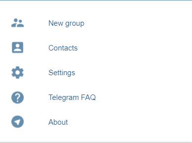

# ITIROD 6th term labs (Лапытько Антон 953505)

### This project is a clone of the telegram messager without using bootstrap and any js frameworks

## Mock ups of the project:

Sign in page: 

Main screen:

Menu:

## In future this project will include such features as:
 - User authorisation
 - Adding contacts by their mobile phone 
 - Creating groups
 - Configuring app to satisfy users needs
 - Sending messages using encryption
 - Marking contacts as favorite

## Data models description:
 - Contact (mobile phone, last_join, nickname, favorite_users)
 - Message (from_user, to_user, content, date)
 - Group (title, users)

## Runnign project guide:
 - Clone this repo
 - Open file index.html in a browser